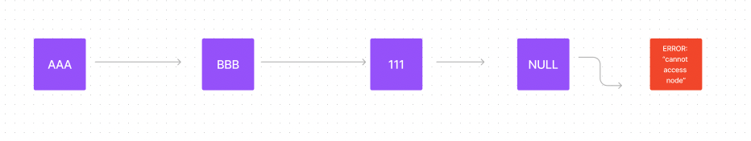

# Class notes on linked lists

A node is a point of connection.

Data Structures and Algorithms

- Think of data structures as ingredients and algorithms as the recipe.

- Algorithms are processes while data structures are containers / a way to organize data to be processed.

What data structures do we already know?

- Arrays: They hold many items; elements of indexed items.

- Objects: Key value pairs that contain properties, flexible.

Algorithms we already know:

- For loops: iterate each index of an array.

- Sort: Orders items in an array.

- Filter: Creates smaller array of items that match condition.

- Map: Convert one array to another kind of array.

- Reduce: Combine all items of an array into a single value.

## Linked Lists

- Linked lists are data stored in sequential or linear form.

- Becomes list when we use our ```next``` pointer.



How do you build a linked list?

- Make a node aka an object with data.

**to insert CCC**

- Point AAA to CCC

- Point CCC to BBB

Example code:

```javascript
class Node {
  constructor ( data, next = null ) {
    this.data = data;
    this.next = next;
  }
}

let AAA = new Node( 'AAA',
  new Node ("BBB, new Node(111)));
let CCC = new Node ('CCC');
  CCC.next = AAA.next;
  AAA.next = CCC;
```

How do you increment an index in a for loop?

- i++

When using linked lists, you would rearrange your pointers.

```javascript
let current = someNode;
current = current.next;
```

After null: you'll get an exception error of "cannot access node".

```javascript
let current = someNode;
  while (current != null){
    //do something
    current = current.next;
  }
```
