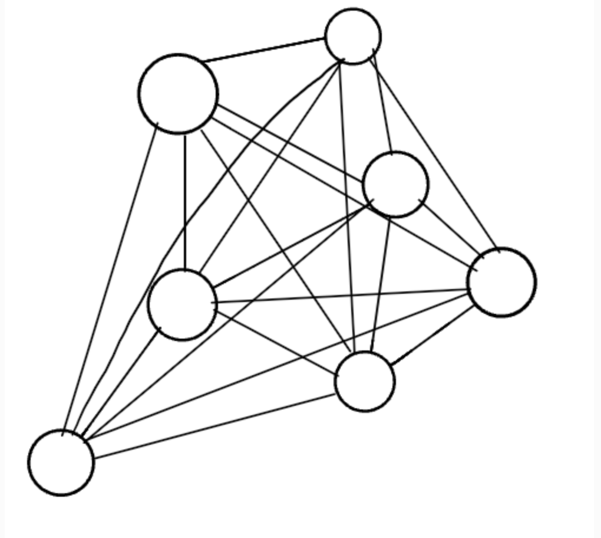
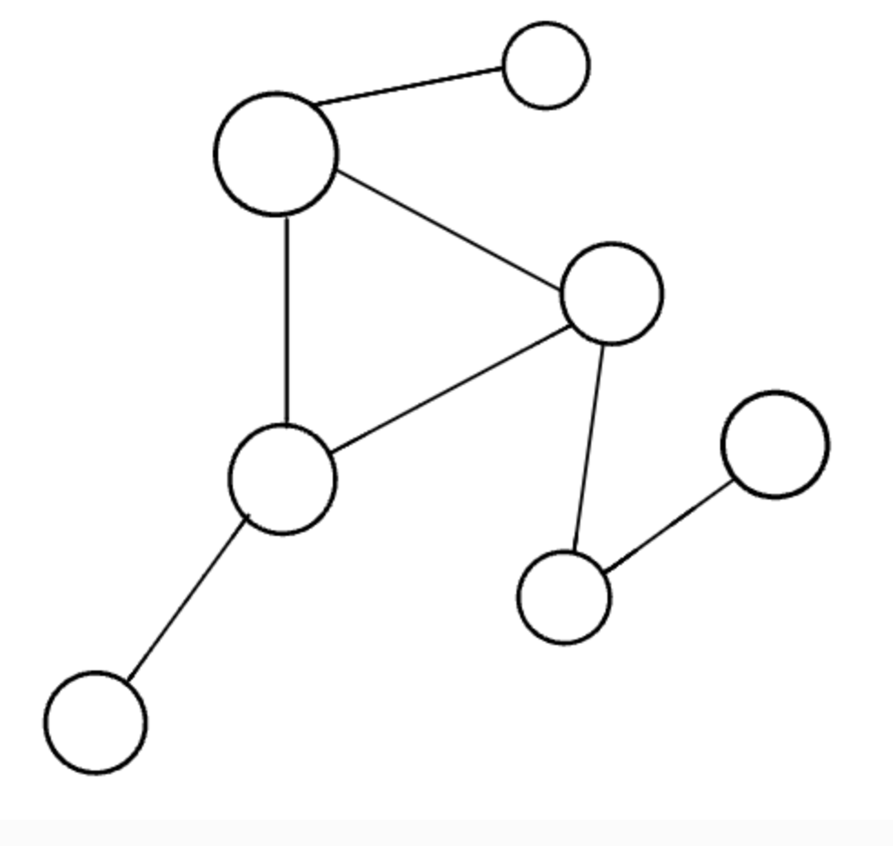
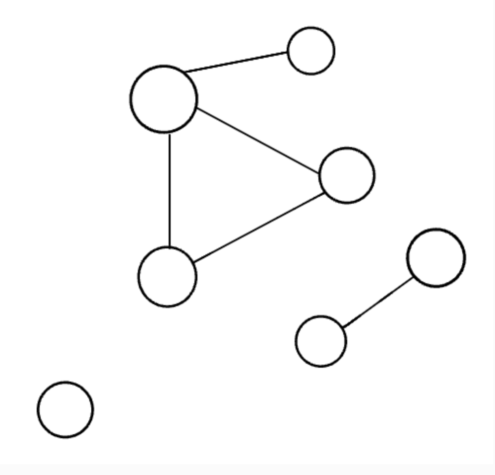

# Implementation: Graphs

[On Graphs](https://codefellows.github.io/common_curriculum/data_structures_and_algorithms/Code_401/class-35/resources/graphs.html)

**Why graphs?**

Some use cases for graphs are:

- GPS and mapping
- Driving directions
- Social Networks
- Airline traffic

**What are graphs?**

- Non-linear data structure: nodes (or vertices) connected by edges.

- Neighbors are vertices that are adjacent to a vertex. Any node connected with an edge.

- Degree relates to the number of edges a node has.

**Terminology and considerations:**

- Undirected graphs are just that, they do not ascribe to a direction. They are bi-directional and can go both ways. In contrast, directed graphs (aka digraphs) have nodes that point to the next value-- they are graphs with direction.

- There are three different types of graphs. Complete, connected, and disconnected.

  - Complete graphs are completely connected. All nodes connect to each other.
  
  - A connected graph is where each node (or vertex) has at least one edge. Trees can be seen as a connected graph.
  
  - Disconnected graphs are where some nodes in the graph do not have edges.
  

- Graphs could also be acyclic or cyclic.
  - Cycles are when a node can be travesed through and potentially end up back at itself. Cycles are also defined as a path of a positive length that starts and ends at the same vertex.
    - Acyclic graphs do not have cycles
    - Cyclic graphs do.

- Weighted graphs are also a thing! This is where the edges of a graph have a number assigned to them.

**How do you use a graph?**

- Graphs can be represented through either adjacency matrixes or adjacency lists.
  - The adjacency matrix is a 2 dimensional array, where an adjacency list lists out all of the possible adjacency values according to a node.

- Traversing through a graph is similar to traversing through a tree.

**Breadth first algorithm:**

- Enqueue the declared start node into the Queue.
- Create a loop that will run while the node still has nodes present.
- Dequeue the first node from the queue
- if the Dequeue‘d node has unvisited child nodes, add the unvisited children to visited set and insert them into the queue.

**Depth first algorithm:**

- Push the root node into the Stack and mark as visited.
- Start a while loop that runs as long as the stack is not empty.
- Pop the top node off of the stack and check its neighbors.
- If a neighbor hasn’t been visited, push it onto the stack and mark as visited.
- Repeat until the stack is empty.