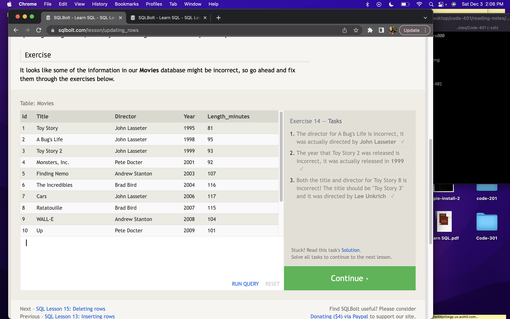

# SQL & Relational Databases

## Notes

- SELECT statements are also knwon as queries.A query. Queries are statements that declare what data we want and where to find it. 

- Think of a table as a thing, rows as instances, and columns as properties.

- In order to filter data, we will use a WHERE statement within the query. This is applied to each row of data and checks for specific column values.

- There are a variety of operators you can use with queries. These are called constraints.

- Using DISTINCT removes any duplicate rows.

- You can also sort SQL results using the ORDER BY operator. This will sort alpha-numerically based on the column's value.

- If you want to receive a set number of results, you can use LIMIT. The OFFSET operation specifies where to begin counting the rows from.

- Normalization is the process of working with more than one table by duplicating data and allowing databases to grow independently of each other.

- Tables that share information about something need to have a primary key that identifies uniquely across the database.

- You can use JOIN to combine row data across two separate tables.

- INNER JOIN matches rows from the first and second table that have the same key.

### SQL Bolt

**Lessons 1-6 & 13-18**

